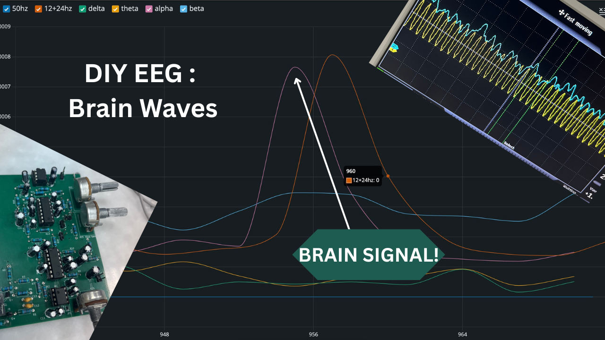

# Custom-1-Channel-EEG(PCB+DSP)
A custom single-channel EEG device from PCB design to real-time brainwave visualization. Features analog front-end filtering, STM32 DSP (biquads, Welch’s), and verified alpha detection (~6 dB SNR, 5× alpha power). 

## Demo

*Click image to watch on YouTube*
Demo: https://youtu.be/_DtyJymNVPs

**Report (PDF):** docs/Custom 1-Channel EEG Device From PCB to Brainwaves.pdf

## Repo layout
- `hardware/` – Gerber Files / BOM / Drill files
- `firmware/` – STM32 (CMSIS-DSP) C-code and libraries
- `docs/` – report, images 

## Quick start
- Build firmware with STM32CubeIDE (or your toolchain).
- Place electrodes: O2(active), mastoid(ref), Fz/forehead(DRL).
- Stream band powers over USART; visualize with serial plotter.

## License
Code: MIT. Hardware: CERN OHL-W (see LICENSE files).
