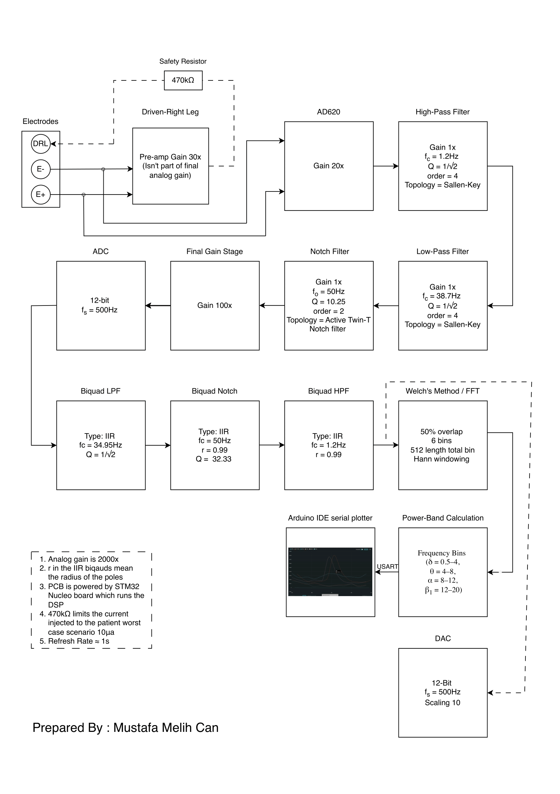

# Custom-1-Channel-EEG (PCB + DSP)

A custom single-channel EEG device developed from PCB design to real-time brainwave visualization.  
Features a low-noise analog front-end with filtering, STM32 DSP (biquads, Welch’s method), and verified alpha detection (~6 dB SNR, ~5× alpha power). See the report to understand how the system works: [Custom 1-Channel EEG Report](docs/Custom_1-Channel_EEG_Device_From_PCB_to_Brainwaves.pdf).

---

## Demo
▶️ Watch the demo video here: [YouTube Link](https://youtu.be/_DtyJymNVPs)  

**Report (PDF):** [Custom 1-Channel EEG Report](docs/Custom_1-Channel_EEG_Device_From_PCB_to_Brainwaves.pdf)

---

## Repository Layout
- `hardware/` – Gerber files, drill files, BOM, LTspice simulations
- `firmware/` – STM32 (CMSIS-DSP) source code and project files
- `docs/` – report, schematics, images

---

## Quick Start
0. To get an overview of the system look at `/docs/1 Channel EEG System Pipeline Final version`. 
1. Build firmware with STM32CubeIDE (or compatible toolchain).  
2. Order PCB using Gerber files from `/hardware/`.  
3. Source components using the BOM in `/hardware/`.  
4. Connect electrodes: **O2** (active), **mastoid** (reference), **Fz/forehead** (DRL).  
5. Stream band powers over USART and visualize with a serial plotter.

---
## Firmware (STM32 NUCLEO Boards)

The firmware is provided as a zipped STM32CubeIDE project in `/firmware/EEG_Firmware.zip`.  
This code runs on STM32 NUCLEO boards (tested on NUCLEO-F446RE, but portable to other STM32 MCUs).  

### How to use:
1. Download and unzip `EEG_Firmware.zip`.  
2. Open **STM32CubeIDE**.  
3. Go to **File → Import → Existing Projects into Workspace**.  
4. Browse to the unzipped folder and select the project.  
5. Build the project (CubeIDE will compile the code automatically).  
6. Connect your NUCLEO board via USB.  
7. Click the **Run/Debug** button in CubeIDE to flash the firmware.

### Pinout (NUCLEO-F446RE)
- **PC3 (ADC3_IN13)** → EEG analog input from PCB  
- **PA4 (DAC_OUT1)** → Filtered signal output (scope/debug)  
- **PA2 (USART2_TX)** → Serial output to PC (band powers)  
- **PA3 (USART2_RX)** → Not used  
- **PA5 (LD2 LED)** → Status indicator (DMA callbacks)  
- **5V & GND rails** → Power for analog PCB  

Once flashed, the board will:  
- Sample EEG signals from the analog front-end.  The ADC is the PC3 pin. 
- Apply DSP (biquads, Welch’s method) in real time you can see the output on PA4. 
- Stream band power values (Delta, Theta, Alpha, Beta) via USART for visualization.
- You can power the PCB using the 5V and GND rails on the Nucleo Board

**Note:** You can view the streamed data using Arduino IDE’s Serial Plotter or any terminal that supports plotting.  

---
## License
- **Code**: MIT License  
- **Hardware**: CERN OHL-W License (see `/LICENCE_Hardware`)
## Disclaimer
- This project is intended for educational purposes only.  
- The creators accept no responsibility for any harm or misuse resulting from its application.

